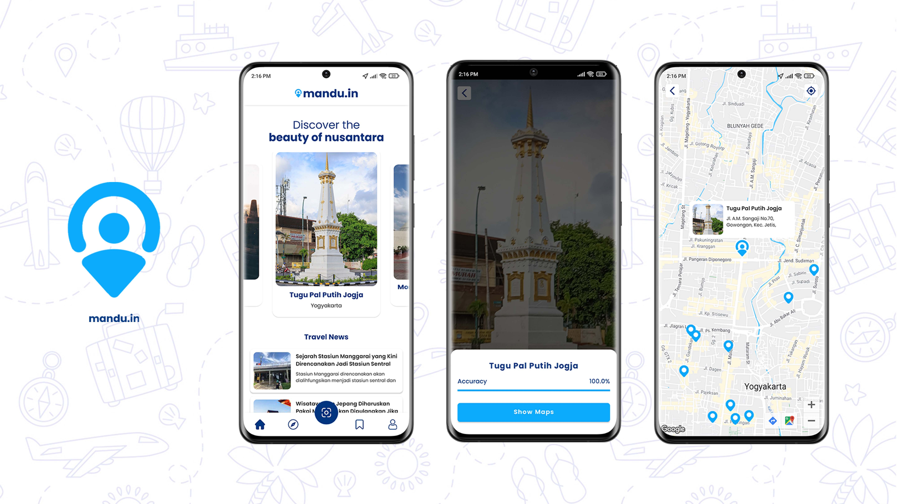

# Mandu.in Apps

This is a repository for Mandu.in Apps which is the final Product Based Capstone Project for Bangkit Academy 2022. This apps is created by team C22-PS028 with 6 students from 3 learning path such as Machine Learning, Mobile Development, and Cloud Computing.

## About Mandu.in

Mandu.in Apps is Android based application that aims to introduce Indonesian tourism, give recommendations to tourists about which place to visit during travel, and educate the tourist to know and understand better about Indonesian tourism. This application uses Machine Learning model to detect landmarks and display the nearest tourism place from those landmarks. This app will also provide information & history about Indonesian landmarks/tourism spots. 

#### Download Link:

Here is the [link](https://drive.google.com/file/d/1fDfXF_4QcsNzybaRa6arrJiawigZP7q6/view?usp=sharing) of Manduin App.

#### Preview:

  

## Meet the Team 

<b> Team ID : C22-PS028</b>

|         Member                    |  Student ID  |        Path        |                University             |                                               
| :------------------------------:  | :----------: | :----------------: |  :----------------------------------: |
|  Muhammad Ridhwan Habib Abdillah  |  M2008G0856  |  Machine Learning  |  Universitas Gadjah Mada              |
|  M. Radjasa Sambaga A. D.         |  M2008G0855  |  Machine Learning  |  Universitas Gadjah Mada              |
|  Luthfi Abdul Khakim              |  A2007F0699  | Mobile Development |  Universitas Dian Nuswantoro          |
|  Louis Bayu Krisna Redionando     |  A2007F0698  | Mobile Development |  Universitas Dian Nuswantoro          |
|  Mira Nabila                      |  C7007F0702  |  Cloud Computing   |  Universitas Dian Nuswantoro          |
|  Ghiyas Ash-Shidiqie Rismawan     |  C2004F0366  |  Cloud Computing   |  Institut Teknologi Sepuluh Nopember  |

## Repository Branches

1. [main](https://github.com/LouisBay/manduin-apps) - About Project
2. [cloud-computing](https://github.com/LouisBay/manduin-apps/tree/cloud-computing) - CC Project Repository
3. [machine-learning](https://github.com/LouisBay/manduin-apps/tree/machine-learning) - ML Project Repository
4. [mobile-development](https://github.com/LouisBay/manduin-apps/tree/mobile-development) - MD Project Repository

## Technologies

1. <b>Machine Learning</b>
   - TensorFlow 
   - Python
2. <b>Android Development</b>
   - Kotlin
   - MVVM Architecture
   - Retrofit (Networking)
   - CameraX (Camera View)
   - Google Service (Maps API)
   - Firebase (Authentication)
   - Dagger-Hilt (Dependency Injection)
   - TensorFlow Lite (Machine Learning)
3. <b>Cloud Computing</b>
   - Cloud SQL (Server Database)
   - App Engine (Server API)

