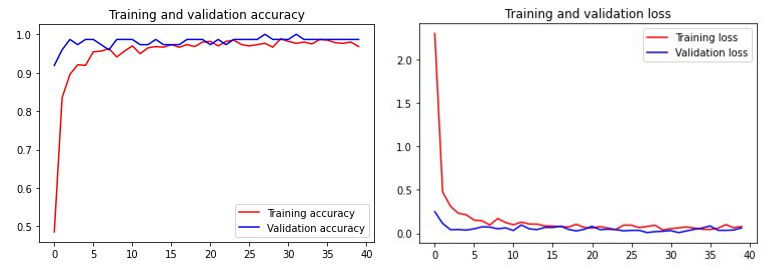

# Machine Learning Branch For Manduin Apps

## Table of Contents

1. [Landmark Classification Model](https://github.com/LouisBay/manduin-apps/tree/machine-learning/Landmark_Recognition_Notebook)
2. [Landmark Image Dataset](https://github.com/mrsambaga/Bangkit-Capstone-Dataset)
3. [Tourism Destination Dataset](https://www.kaggle.com/datasets/aprabowo/indonesia-tourism-destination)
4. [TFLite Model](https://drive.google.com/drive/folders/1jzKucwzypVAmtW5rCzH4nj8Bdu1IsWSZ?usp=sharing)

## 1. Landmark Classification Model

For landmark classification model, we created 2 kinds of model :
1. Model made from scratch
2. Model with transfer learning using InceptionV3.

**Model Made From Scratch** 
For the first model, we made basic image classification model with 5 layers of convolutional neural network. With dataset around 665 total images for 6 classes, we achieved **0.9167 validation accuracy** and **0.3701 validation loss**. We understand that this dataset is far from sufficient on creating a perfect model since we struggled on tackling overfitting after several tuning. 

**Model with transfer learning using InceptionV3** 
For the second model, we tried transfer learning using InceptionV3 model. InceptionV3 is an upgraded version from InceptionV1 which was introduced as GoogLeNet in 2014. As the name suggests it was developed by a team at Google. InceptionV3 architecture consist of Convolutional Neural Networks with 48 layers deep. With InceptionV3, our model performance is significantly better despite having small amount of dataset. After 40 epoch, our model quickly achieved **0.9865 validation accuracy** and **0.0617 validation loss**

## 2. Landmark Image Dataset

We collected dataset manually by scraping from Google images. In total, we accumulated 2067 images for 15 landmarks. The distribution as follows:

1. Lawang Sewu : 115
2. Candi Borobudur : 131
3. Candi Prambanan : 194
4. Masjid Agung Jawa Tengah : 111
5. Tugu Jogja : 100
6. Monjali : 88
7. Besakih : 200
8. Suroboyo : 216
9. Garuda Wisnu Kencana : 100
10. Monumen Nasional : 146
11. Gedung Sate : 140
12. Jam Gadang : 115
13. Sam Poo Kong : 148
14. Taman Ayun : 130
15. Museum Fatahillah : 134

Due to time limit and unavailable nearby tourism dataset for certain landmark, we only put 6 landmark in our final product which focused on landmark from Yogyakarta & Central Java (Lawang Sewu, Borobudur, Prambanan, Masjid Agung, Tugu Jogja, and Monjali).

**Processing Technique** 

We use [Download All Images](https://chrome.google.com/webstore/detail/download-all-images/ifipmflagepipjokmbdecpmjbibjnakm?hl=en) chrome extension to download multiple images from Google simultaneously. After that, we can quickly detect duplicate images and remove them automatically using Image Hashing & Hamming Distance method with Python script from this [repository](https://github.com/moondra2017/Computer-Vision) (Credit : [moondra2017](https://github.com/moondra2017))

## 3. Tourism Destination Dataset

We use tourism destination dataset to get various information about tourism destination including landmark such as description, rate, coordinate, ticket price, etc. This dataset is used to create a list of closest nearby tourism destination from the detected landmark and put them in google map API. Futhermore, we use this dataset to create description and full information about each tourism destionation in the application. Dataset taken from Kaggle & can be accessed through this [link](https://www.kaggle.com/datasets/aprabowo/indonesia-tourism-destination). 

## 4. TFLite Model

For model deployment, we convert .h model into TFLite to make it smaller and compatible for mobile device. Our final TFLite model has size of 60mb & can be accessed through this [Google drive](https://drive.google.com/drive/folders/1jzKucwzypVAmtW5rCzH4nj8Bdu1IsWSZ?usp=sharing). 
