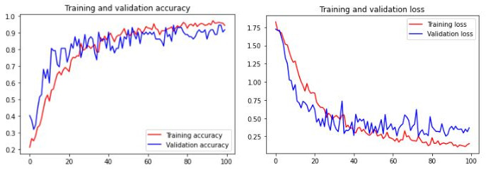

# Machine Learning Branch For Manduin Apps

## Table of Contents

1. [Landmark Classification Model](https://github.com/LouisBay/manduin-apps/tree/machine-learning/Landmark_Recognition_Notebook)
2. [Landmark Image Dataset](https://github.com/mrsambaga/Bangkit-Capstone-Dataset)
3. [Tourism Destination Dataset](https://www.kaggle.com/datasets/aprabowo/indonesia-tourism-destination)
4. [TFLite Model](https://drive.google.com/drive/folders/1jzKucwzypVAmtW5rCzH4nj8Bdu1IsWSZ?usp=sharing)

## 1. Landmark Classification Model

For landmark classification model, we created 2 kinds of model :
1. Model made from scratch
2. Model with transfer learning using InceptionV3.

**Model Made From Scratch** 
For the first model, we made basic image classification model with 5 layers of convolutional neural network. With dataset around 665 total images for 6 classes, we achieved **0.9167 validation accuracy** and **0.3701 validation loss**. We understand that this dataset is far from sufficient on creating a perfect model since we struggled on tackling overfitting after several tuning. 

**Model with transfer learning using InceptionV3** 
For the second model, we tried transfer learning using InceptionV3 model. InceptionV3 is an upgraded version from InceptionV1 which was introduced as GoogLeNet in 2014. As the name suggests it was developed by a team at Google. InceptionV3 architecture consist of Convolutional Neural Networks with 48 layers deep. With InceptionV3, our model performance is significantly better despite having small amount of dataset. After 25 epoch, our model quickly achieved **0.9467 validation accuracy** and **0.0111 validation loss**

## 2. Landmark Image Dataset

## 3. Tourism Destination Dataset

## 4. TFLite Model

